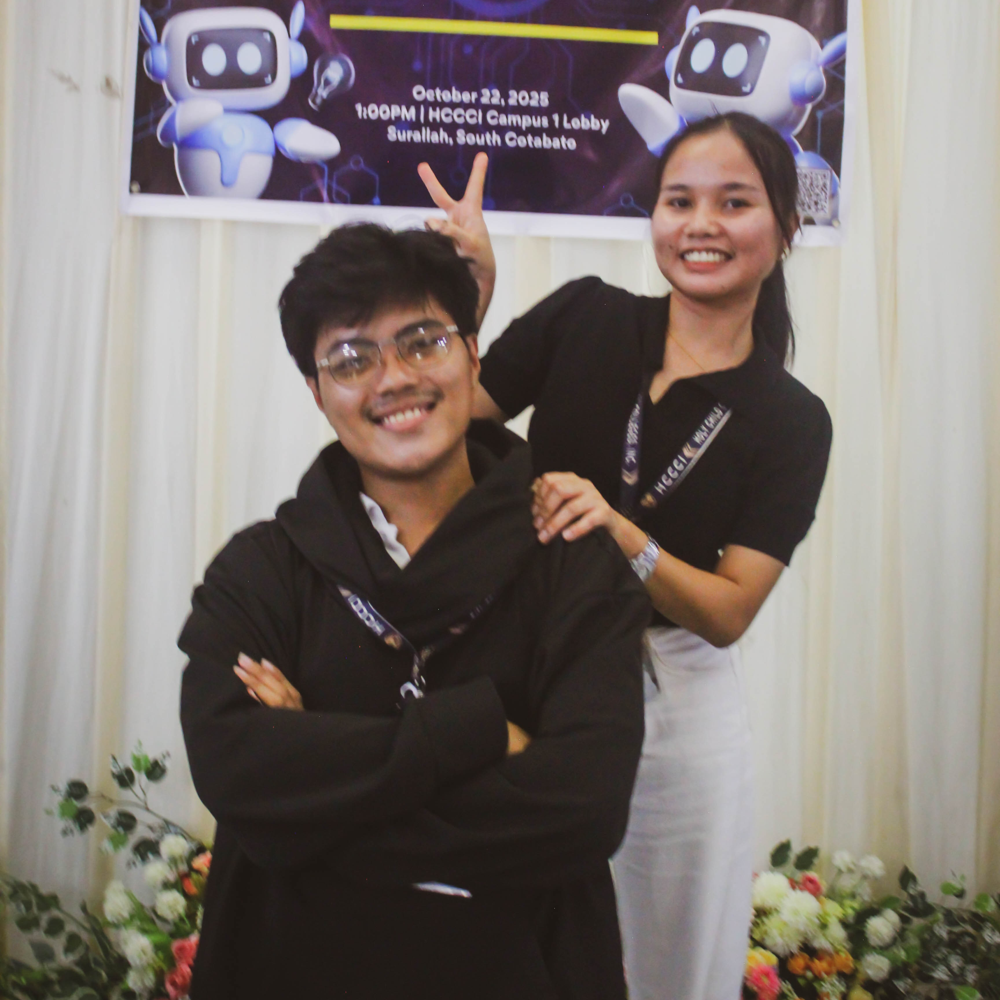

# 🚀 Quick Start Guide

Get your romantic website up and running in 5 minutes!

## Step 1: Open the Website (2 minutes)

### Option A: Direct Open (Simple)
1. Open the `index.html` file directly in your web browser
2. Click on "Games" to see the interactive games
3. Click on "Special Letter" to see the love letter

### Option B: Use Local Server (Recommended)
Better experience and all features work properly.

**Windows (Command Prompt)**
```bash
cd path\to\Second Monthsary Website
python -m http.server 8000
```
Then open: http://localhost:8000

**Mac/Linux (Terminal)**
```bash
cd path/to/Second\ Monthsary\ Website
python3 -m http.server 8000
```
Then open: http://localhost:8000

## Step 2: Explore the Website (2 minutes)

### Main Page (index.html)
- ✨ Hero section with romantic title
- 📸 Memory gallery (click images for full view)
- 📅 Timeline of your relationship
- 💝 Reasons why you love them
- ⏱️ Live love counter
- 🎡 Favorite things carousel
- 💌 Secret message button (floating heart)

### Games Page (gamesUI.html)
- 🎯 7 different interactive games
- 📊 Score tracking
- 🎮 Fun, romantic challenges
- Navigate via "Games" link in nav bar

### Special Letter (special.html)
- 💌 Beautiful love letter
- ✨ Falling petals animation
- 💕 Special romantic question
- 🎉 Celebration effects
- Navigate via "Special Letter" link

## Step 3: Customize (5 minutes)

### Essential Customizations

**1. Add Your Date**
Open `script.js`, find this line (around line 10):
```javascript
RELATIONSHIP_START: new Date('2024-03-09'),
```
Change to your date:
```javascript
RELATIONSHIP_START: new Date('2024-03-09'), // YOUR DATE
```

**2. Add Your Photo**
- Save couple photo as `couple-photo.jpg`
- Place in: `assets/images/`
- Edit `index.html` hero section (around line 48):
```html

```

**3. Customize Text**
In `index.html`:
- Change title, subtitle (around line 33-35)
- Update timeline events (search for "Timeline Item")
- Edit reasons cards (search for "Why I Love You")
- Update memory captions

In `special.html`:
- Replace the love letter text (around line 60)

### Optional Customizations

**Add Music**
- Save music as `romantic.mp3`
- Place in: `assets/music/`
- Edit `script.js` around line 207, uncomment:
```javascript
backgroundMusic.src = 'assets/music/romantic.mp3';
```

**Change Colors**
In `style.css`, edit these variables (around line 7):
```css
--primary-pink: #ff1493;        /* Change pink */
--primary-purple: #5d3a8e;      /* Change purple */
--neon-purple: #d946ef;         /* Change neon */
```

## Step 4: Test Everything (3 minutes)

### Desktop Testing
- [ ] All pages load
- [ ] Images display correctly
- [ ] Navigation works
- [ ] Scroll animations work
- [ ] Games open and work
- [ ] Music toggle works (if added)

### Mobile Testing
- [ ] Open on phone/tablet
- [ ] All text is readable
- [ ] Buttons are clickable
- [ ] Images load on mobile
- [ ] Navigation hamburger works
- [ ] Games work on touch

### Browser Testing
- [ ] Chrome ✅
- [ ] Firefox ✅
- [ ] Safari ✅
- [ ] Edge ✅

## Step 5: Add More Content (Optional)

### Add Memory Photos
1. Place photos in: `assets/images/memory1.jpg`, `memory2.jpg`, etc.
2. Update `index.html` memory cards (around line 85-106)
3. Change captions to match your memories

### Add Game Questions
Edit `script.js` `CONFIG` section:
```javascript
QUIZ_QUESTIONS: [
  { q: 'Your custom question?', options: [...] },
  // Add more
],
```

### Add Special Reasons
Edit `index.html` reason cards (around line 186):
```html
<div class="reason-card">
  <div class="reason-text">Your custom reason here ❤️</div>
</div>
```

## 🎯 Checklist Before Sharing

- [ ] Added your relationship start date
- [ ] Added couple photo to hero section
- [ ] Customized timeline events
- [ ] Updated reason cards
- [ ] Updated love letter text
- [ ] Memory captions are correct
- [ ] Tested on multiple devices
- [ ] Tested all games
- [ ] Music is set up (optional)
- [ ] All colors/styling match your vision

## 🎁 How to Share

### Share the Experience

**Share Full Website**
- Send the folder link
- Or upload to hosting service
- Or use: Netlify, Vercel, GitHub Pages

**Share Special Moment**
- Send `special.html` link
- Opens to special letter with celebration
- Perfect for big reveal!

**Share Games**
- Send `gamesUI.html` link
- Play games together online

### Recommended Sharing Methods

1. **For Local Sharing**
   - Email website folder link
   - Share via cloud storage (Google Drive, Dropbox)
   - Print QR code of website URL

2. **For Online Sharing**
   - Upload to Netlify (free, easy)
   - Upload to Vercel (free, fast)
   - GitHub Pages (free, technical)

### How to Upload to Netlify (Easy)
1. Go to https://app.netlify.com
2. Sign up (free with GitHub/Google account)
3. Drag and drop your project folder
4. Get instant URL to share!
5. Share the URL with your love!

## 💡 Pro Tips

### Make It Extra Special
1. ⭐ Add your best couple photos
2. 🎵 Add your song as background music
3. 💌 Write personalized love letter
4. 🎮 Create custom game questions
5. 🎨 Change colors to their favorite colors
6. 📱 View on mobile first time with them

### Best Viewing Experience
- Full screen browser
- Dark room with ambient light
- Volume on for music
- Heart ready! 💜

### Engagement Ideas
- Start with the main page (emotional journey)
- Then play games together (fun interaction)
- End with special letter (big reveal)
- Celebrate together! 🎉

## ❓ Common Questions

**Q: Do I need internet?**
A: No! Opens locally. Only needs internet if you host online.

**Q: Can I edit after sharing?**
A: Yes! Make changes and reshare the link.

**Q: What if they see it early?**
A: Create password protection (advanced) or send only special.html link at the right time.

**Q: Can I update it later?**
A: Absolutely! Add new memories, anniversaries, experiences.

**Q: Will it work on older phones?**
A: Works on most phones from last 5 years. Test first.

## 🆘 Troubleshooting

### Images Not Showing
- Check file names match exactly
- Ensure images in `assets/images/` folder
- Refresh browser (Ctrl+Shift+R)
- Try different browser

### Games Not Working
- Clear browser cache
- Refresh page
- Try different browser
- Check console (F12) for errors

### Music Won't Play
- Verify file in `assets/music/` folder
- Check browser allows autoplay
- Try after user interaction
- Different browsers have different rules

### Website Looks Weird
- Update browser to latest version
- Clear cache and cookies
- Try fullscreen mode
- Test on different device

## 📞 Need Help?

1. **Check README.md** - Full documentation
2. **Check ASSETS_GUIDE.md** - Media setup help
3. **Test in different browser** - Sometimes browser specific
4. **Check browser console** (F12 → Console) for error messages
5. **Google the error message** - Often has quick solutions

## 🎉 You're Ready!

That's it! Your romantic website is ready to celebrate your love!

### Final Steps
1. ✅ Customize with your details
2. ✅ Add your photos and music
3. ✅ Test thoroughly
4. ✅ Share with your special someone
5. ✅ Celebrate your monthsary! 💜

---

**Made with love for your special celebration! 💜✨**

Need more help? Open the detailed README.md file for comprehensive documentation.

Good luck, and happy monthsary! 🌹❤️💕
